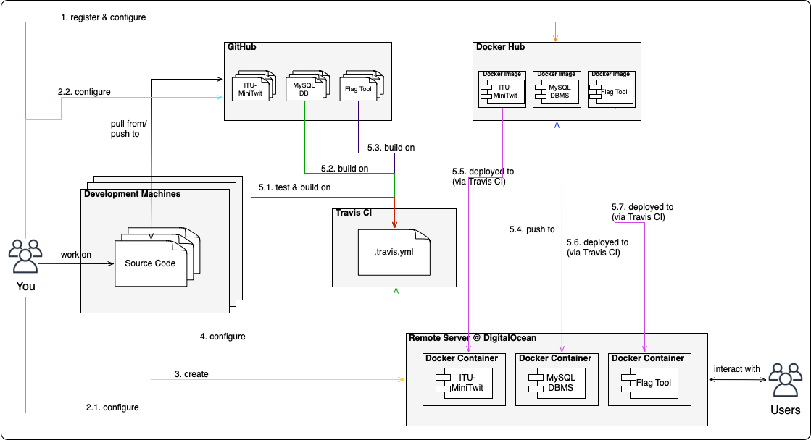
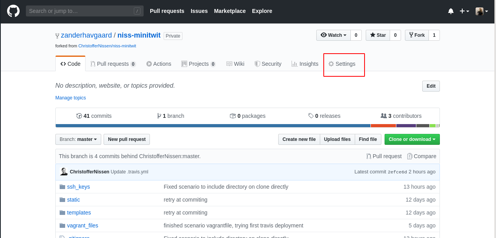
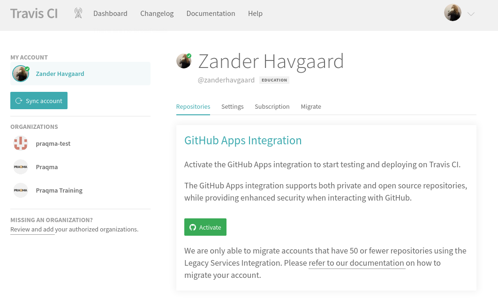
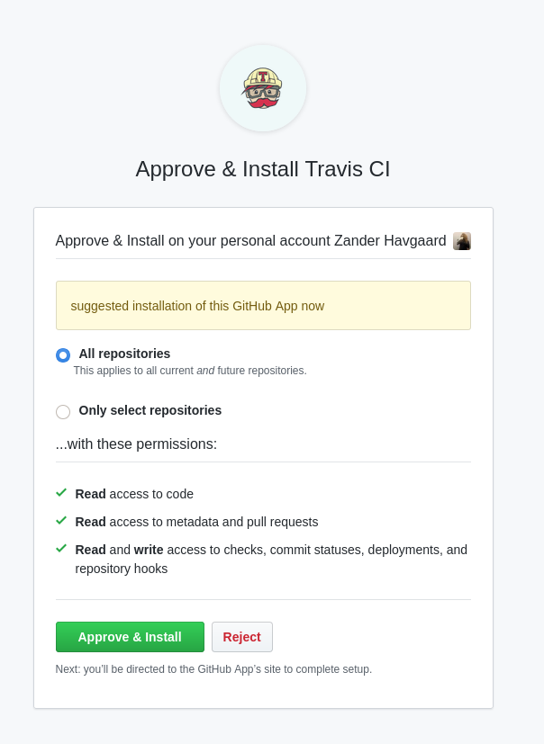
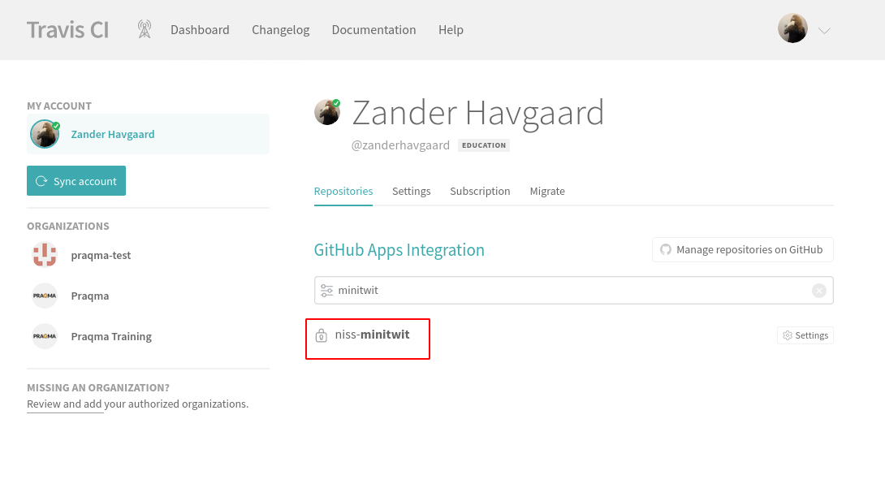
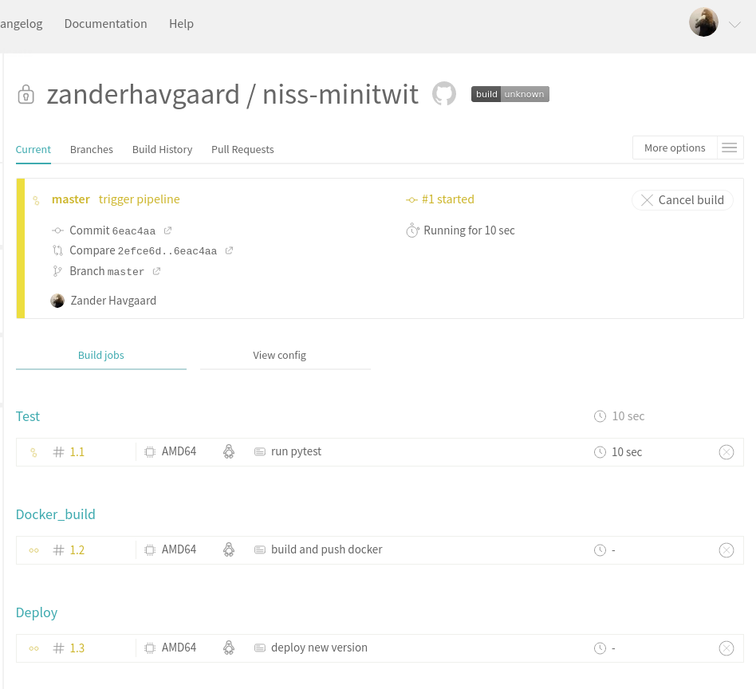

# ITU-MiniTwit CI/CD Scenario

## 1.) Requirements


  * In case you are not already, register at Docker Hub (https://hub.docker.com/) 
    - To make a later step more straight forward, use a password without any special characters.
    - From now on we refer to your login ID from Docker Hub as `DOCKER_USERNAME` and your password there is called `DOCKER_PASSWORD`.
  * Login at Docker Hub and create three public repositories with the following names (by clicking the big blue `Create Repository` button in the top right).
    - `mysqlimage`
    - `minitwitimage`
    - `flagtoolimage`
  * You need to be signed up at DigitalOcean (https://www.digitalocean.com/).
  * Fork this repository (https://github.com/itu-devops/itu-minitwit-ci) by clicking on the fork button on Github
  * Clone your fork of the repository:

  ```bash
  $ git clone https://github.com/<you_gh_user>/itu-minitwit-ci.git
  $ cd itu-minitwit-ci
  ```

  * Add your Docker Hub credentials to the `Vagrantfile`, that is replace `<your_dockerhub_id>` and `<your_dockerhub_pwd>` on lines 34 and 35 with your login ID and password. **OBS** Remember to not push these credentials back to a public repository.

----

To setup this scenario we have two parts:
- A remote server to which we will deploy out ITU-MiniTwit application and which is provisioned on DigitalOcean using `vagrant`.
- A Travis CI pipeline, which we will use to automate tests, build the application (in Docker images) and deploy them to the server.





----

# Preparation

## 2.) SSH Key Pair

In order to connect to the server we are going to provision, we will use rsa keys for authentication. Thus we can also give the SSH key to the Travis CI pipeline, such that it can automatically deploy new versions on our server.

Change directory to `ssh_keys` with `cd ssh_keys`. If the directory is not present you can create it with `mkdir ssh_keys`. The `-m "PEM"` sets the format of the keys we will generate to a format that Travis CI supports. The following command will generate the keys:

```bash
$ cd ssh_keys
$ ssh-keygen -m "PEM"
```

<!-- ssh-keygen -t rsa -b 4096 -m "PEM" -->

When prompted for name type `do_ssh_key` and hit enter three times to accept the other defaults. You can call the SSH key files whatever you want, but the `Vagrantfile` expects the SSH keys to have that specific name.


## 2.1.) Register you Public SSH at DigitalOcean

Now, after generating the keys, log into DigitalOcean and navigate to the security configuration, left bottom under `ACCOUNT` -> `Security`.

Under `SSH keys` click the `Add SSH Key` button and register a `New SSH key` with the name `do_ssh_key`. Paste into the input field the contents of `ssh_keys/do_ssh_key.pub`, which you might receive via: `cat ssh_keys/do_ssh_key.pub` on the command line.


## 2.2.) Add SSH key to Github repository

Add the generated SSH key to your Github repository, such that Travis CI can clone our repository when we run the pipeline. Navigate to the page of the repository on github.com in your browser and click the `Settings` tab:



Now click `Deploy keys` and then `Add deploy key`. Set the title to something like "Travis CI pipeline" so that you know who has access through this key. Then paste the contents of the **public** key of the SSH keys we generated earlier. The public key is the one that has the `.pub` extension, in our case the file is `ssh_keys/do_ssh_key.pub`. Paste contents of that file into the Key field.


Finish by clicking `Add key`.


--------------------

# 3.) Creating a Remote Server

## Vagrant DigitalOcean Plugin

We assume you have `vagrant` installed, now make sure to install the DigitalOcean plugin, that will allow us to provision DigitalOcean machines using vagrant:

```bash
$ vagrant plugin install vagrant-digitalocean
```

## DigitalOcean Token

In order create virtual machines at DigitalOcean via `vagrant` we must generate an authentication token. Log in to DigitalOcean in your browser, then navigate to `API` in the menu on the right, then click on `Generate New Token`. You must give it a name, for example the name of the machine where you use the token.


The `Vagrantfile` expects to find your token from your shell environment, so you can for example add it to your `~/.bashrc` or `~/.zshrc`. The variable must be called: called `DIGITAL_OCEAN_TOKEN`, the syntax for defining such an environment variable in your shell configuration file is:

```bash
export DIGITAL_OCEAN_TOKEN=<your-token>
```

After adding the token you must reload your shell, i.e., either close your current terminal and open a new one or use the `source` command on the shell config file you changed, e.g. `source ~/.bashrc`.


## Starting the Remote Server

First, change directory back to the root of the Git repository with `cd ..`.

Now, you should be able to create the remote VM via `vagrant up`. You can use the below command to ensure that vagrant will use the DigitalOcean provider:

```bash
$ vagrant up --provider=digital_ocean
```


Note down the IP of this server as we will need it in a later step. It should be displayed after the server was created.


### `/remote_files`

All files contained in the directory `remote_files` will be synced to the newly provisioned server. Currently, this is only a single `docker-compose.yml` file which later will be used to deploy our ITU-MiniTwit application automatically.


<!--
When the server has finished initalizing, it use docker-compose file to start minitwtit with the command `docker-compose up -d`. The `up` command actually does a lot of things: first it will check if the images specified in the docker-compose.yml are present, if they are not it will attempt to pull them from `hub.docker.com` or any other private registries it might be signed into. Next the `up` command will check if there are any running conatiners of the images, and if there are none, it will create them, if they are present, but an older version, the images that have a newer version available will be recreated with newer version. If all containers are up to date, then nothing will happen. The `-d` will start the docker containers as `daemons` in the background.

Whenever the `mysql` container is restarted it needs ~20 seconds to initialize, so don't panic if the url shows a mysql error, just wait a moment and reload the page.
-->

### SSH to server

If you need to SSH to remote server you can easily do it through `vagrant` with the `ssh` command:

```bash
$ vagrant ssh
```

You can also do it 'manually' like so:
```bash
$ ssh root@<digital-ocean-machine-ip> -i <path_to/do_ssh_key>
```

------


# Travis CI Pipeline

Now, we will setup the Travis CI pipeline.

##  4.) Configuration

### Sign up for Travis CI

Start by signing up for Travis CI. Navigate with your browser to `https://travis-ci.com` and select `Sign up with Github`.


Then, you will be taken to the authorization page, confirm the use of the app.


You should now be redirected to an empty dashboard.

### Authorize Travis CI

Now, we will setup Travis CI to run a CI/CD pipeline whenever we push commits to our repository. Start by clicking on your profile picture in the upper right corner (make sure to click the image and not the dropdown arrow!).


Now, we must authorize the "Github Apps Integration". Click the `Activate Button`.



Then approve.



Now, you should see a list of your repositories. Use the search bar to filter to for the `itu-minitwit-ci` repository and click its name:




#### SSH Key Configuration

For this scenario we will have to modify some settings:

First, we have to add our SSH key such that Travis CI can clone our repository. Go to the pipeline settings tab:


Scroll down to `SSH Key`. Then give the new key a name, i.e., `github + digital_ocean` and in SSH key field paste in the **private** key we generated earlier, e.g., the contents of `ssh_keys/do_ssh_key`, and finish by clicking `Add`.


#### Environment Variables

Next, we have to add some environment variables, scroll to `Environment Variables`.

For this scenario you must set the following environment variables:

- `DOCKER_USERNAME` username for hub.docker.com
- `DOCKER_PASSWORD` password for username for hub.docker.com
- `MT_USER` the user we will SSH to, default is `root`
- `MT_SERVER` the IP address of the server we created on DigitalOcean, which you noted down earlier.


These are key-value pairs that are substitutes for their actual value when the pipeline runs. They are never printed to any logs, so this is the way to add "secrets" to your pipeline, like login usernames and passwords.

## 5.) `.travis.yml` - A Pipeline's Configuration File

In order to build using Travis CI pipelines, we must add a file to the root of the Github repository called `.travis.yml` that contains the all of the commands to be executed by the pipeline. The nice thing about this being a file in our Git repository is that we can version it along with the rest of our code and keep all of our code and configuration in the same place without having to use any web GUI's - Configuration as Code!

The scenario should already have a sample `.travis.yml` in the repository.

```yaml
os: linux
dist: bionic

language: python
python:
  - 3.7

services:
  - docker  # required, but travis uses older version of docker :(

install:
  - docker --version  # document the version travis is using

stages:
  - docker_build
  - test
  - deploy

jobs:
  include:
    - stage: docker_build
      name: "build and push docker"
      script:
        - echo "LOGIN"
        - echo $DOCKER_PASSWORD | docker login -u $DOCKER_USERNAME --password-stdin
        - echo "BUILD"
        - docker build -t $DOCKER_USERNAME/minitwitimage:latest . -f Dockerfile-minitwit
        - docker build -t $DOCKER_USERNAME/mysqlimage:latest . -f Dockerfile-mysql
        - docker build -t $DOCKER_USERNAME/flagtoolimage:latest . -f Dockerfile-flagtool
        - echo "PUSH"
        - docker push $DOCKER_USERNAME/minitwitimage:latest
        - docker push $DOCKER_USERNAME/mysqlimage:latest
        - docker push $DOCKER_USERNAME/flagtoolimage:latest

    - stage: test
      name: "run pytest"
      install: skip
      script:
        - docker build -t $DOCKER_USERNAME/minitwittestimage -f Dockerfile-minitwit-tests .
        - yes | docker-compose up -d
        - docker run -it --rm --network=itu-minitwit-network $DOCKER_USERNAME/minitwittestimage

    - stage: deploy
      name: "deploy new version"
      install: skip
      # -o flag to get around "add ip to known hosts prompt"
      script: |
        ssh -o "StrictHostKeyChecking no" ${MT_USER}@${MT_SERVER} \
        "source /root/.bash_profile && \
        cd /vagrant && \
        docker-compose pull && \
        docker-compose up -d"

```

This pipeline is divided into three stages:
  
  - `docker_build`
    - The build stage will first build our three Docker containers and subsequently push them to `hub.docker.com`.
  - `test`
    - The test stage runs some automated frontend tests on our application, to check that everything is still working. If the test fails the pipeline will abort and alert you that the tests are failing.
  - `deploy`
    - The final stage deploys the new version to our remote server by opening an SSH connection and, which remotely sets-up the environment variables (`source /root/.bash_profile`), pulls the freshly built Docker images from hub.docker.com (`docker-compose pull`), and finally updates the running containers to the new version (`docker-compose up -d`).

Note, that each stage is executed in a freshly provisioned VM, so no state carries over from stage to stage, unless you explicitly tell Travis CI to do so.

## Trigger Pipeline

Now we are ready to trigger the pipeline. If all of the above went well, a new version of ITU-MiniTwit should be build, tested, delivered, and deployed on every new commit to the repository.



---


# Credits

This scenario would not have been so extensive and described so well without [Zander's](https://github.com/zanderhavgaard) and [Christoffer's](https://github.com/ChristofferNissen) efforts!

---


For some more details on the docker images see the file `readme_dockerized.md`
